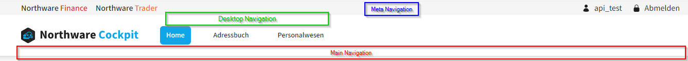
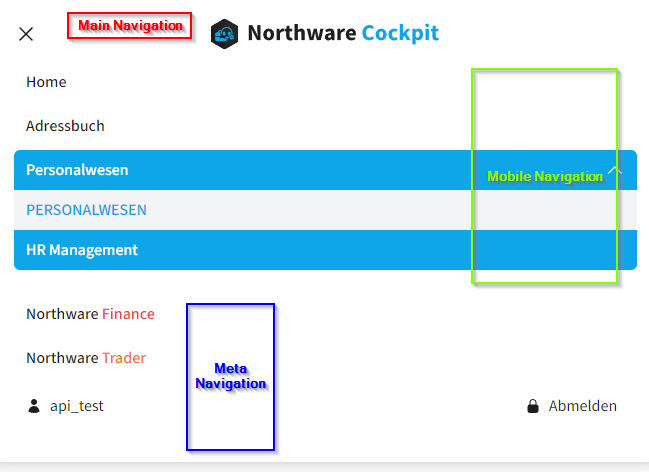

# Nav Komponente Navigation

Datei-Pfad: `theme/components/Nav.js`

Die Nav-Komponente ist für die Haupt-Navigation zuständig. Sie ist auf eine mobile Ansicht (SM-Breakpoint) angepasst.
Die Komponente ist sehr umfangreich. Vielleicht ist also nicht an jeder Stelle alles ganz verständlich. Als Grundlage für die Komponente habe ich eine [Navbar von Tailwind UI](https://tailwindui.com/components/application-ui/navigation/navbars)(die kostenlose Variante "Simple dark with menu button on left" mit dem React-Code). Diese Komponente nutzt schon von Haus einige Komponenten von [Headless UI](https://headlessui.com/) und Icons von [heroicons](https://heroicons.com/). Ich habe den Beispiel-Code dann an einigen Stellen verändert und erweitert.



_Navigation in der Desktop-Ansicht_



_Navigation in der Mobile Ansicht_

## Daten für die Navigation

Die Daten für die Navigation (Labels, Pfade, Unterpunkte) kommen aus Strapi (Content-Type `mainNav`).

```jsx
const { loading, error, data } = useQuery(QUERY, barer_authentication);

if (loading) {
  return <Loader />;
}

if (error) {
  if (
    error.graphQLErrors[0]?.extensions?.code == "FORBIDDEN" ||
    error.networkError.statusCode == 401
  ) {
    window.location.reload();
  }
}
```

Wenn die Daten aus Strapi noch geladen werden, wird die `<Loader>` Komponente gerendert. Es gab Probleme mit dem Loading weshalb ich die Schreife `if(error) {...}` eingebaut habe, den bei dem ersten Loading nach der Anmeldung können die Navigationspunkte warum auch immer noch nicht geladen werden. Die Navigation würde also so lange laden, bis sie Berechtigungen für `mainNavbar` erhält.

## Meta Navigation

Die Meta-Navigation ist von der `mainNavbar` unabhängig. In der Desktop-Ansicht befindet sie sich oberhalb der eigentlichen Navigation. In der Navigation links befinden sich Links zu anderen Northware Apps.

```jsx
<Menu as="div" className="appswitch-menu">
  {process.env.NEXT_PUBLIC_CP_FRONT !== "current" ? (
    <Menu.Button className="appswitch-item">
      <Link
        href={process.env.NEXT_PUBLIC_CP_FRONT}
        className="appswitch-link hover:decoration-cockpit-500"
      >
        <span>
          Northware <span className="text-cockpit-500">Cockpit</span>
        </span>
      </Link>
    </Menu.Button>
  ) : (
    ""
  )}
  ...
</Menu>
```

Welche Apps hier zu sehen sind, richtet sich nach den Environment-Variablen der jeweiligen App. In jeder App sollten die Environment-Variablen `NEXT_PUBLIC_CP_FRONT`(URL des Cockpit-Frontend), `NEXT_PUBLIC_FI_FRONT`(URL des Finance-Frontend), `NEXT_PUBLIC_TRD_FRONT`(URL des Trader Frontend) usw. definiert sein. In der App in der sich der User gerade befindet sollte die Environment-Variable `current` lauten. Wenn sich der User also im Northware Cockpit befindet lautet die Environment-Variable `NEXT_PUBLIC_CP_FRONT = 'current'`, also wird der Link zu Northware Cockpit hier nicht angezeigt.

Auf der rechten Seite der Meta-Navigation wird der aktuell angemeldete User angezeigt und es gibt einen Link für den Logout.

```jsx
<Menu as="div" className="metanav-right">
  <p className="flex items-center">
    <UserIcon className="mr-2 h-4" />
    {user?.username || "Nicht angemeldet"}
  </p>
  <Menu.Button className="menuitem-meta" onClick={handleLogout}>
    <LockClosedIcon className="mr-2 h-4" />
    Abmelden
  </Menu.Button>
</Menu>
```

Der Benutzername `user` wird oberhalb des `return()`-Blocks über `useAuthContext()` von Strapi gefetcht.

Der Button zum abmelden führt die Funktion `handleLogout()` aus. Diese Funktion löscht alle Daten, die den User beinhalten und führt den User zurück zum Root. In der Layout-Komponente wird dadurch das Login-Formular ausgegeben.

```jsx
// User Auth und Logout

const { user, setUser } = useAuthContext();

function handleLogout() {
  setUser(null);
  Cookie.remove("token");
  router.push("/");
}
```

Die Meta-Navigation wird von einem Div umgeben, der die Tailwind-Klassen `.hidden` und `.md:flex` besitzt. Das führt dazu, dass diese Meta-Navigation so nur in der Desktop-Ansicht zu sehen ist.

## Disclosure .mainnav

Die Hauptnavigation wird von einem `<Disclosure>` umschlossen. Die Komponente ermöglicht eine Funktionalität die man zum Beispiel als Dropdown oder eben als Grundlage für ein Responsives Menü einsetzen kann.

Das `Disclosure` wird hier nur als Grundlage genutzt. Es gibt einen `Disclosure.Button` (ein Hamburger-Menü Toggle-Button) der aber von einem Div umgeben wird, der den Button auf größeren Bildschirmen mit .md:hidden versteckt. Auf Bildschirmen ab dem md-Breakpoint kann über den `Disclosure.Button` die mobile Navigation aufgerufen werden.

Die mobile Navigation selbst befindet sich im `Disclosure.Panel` also dem Wrapper der sichtbar wird, wenn der User auf den `Disclosure.Button` tippt.

### Branding

Auf beiden Ansichten wird das Logo der App angezeigt. In den Desktop-Ansichten befindet sich das Logo links in der Navigation. In der mobilen Ansicht rutscht das Logo in die Mitte der Navigation.

### Desktop only Navigation

Das Menü für die Desktop-Ansicht wird von einem Div umgeben, der die Klassen `hidden md:flex` besitzt, damit dieses Menü nur in Desktop-Ansichten zu sehen ist. Hier geht es nur um die Menüpunkte der Hauptnavigation.

Für jeden Eintrag im Array `navcontent` wird ein Menüpunkt gerendert.

Der Array `navcontent` wird oberhalb des `return()`-Bereichs definiert. Und beinhaltet die Menüpunkte für die jeweilige App.

```jsx
let navcontent = data?.mainNavbar?.data?.attributes?.mainnav_cockpit;
if (service === "cockpit") {
  navcontent = data?.mainNavbar?.data?.attributes?.mainnav_cockpit;
}
if (service === "finance") {
  navcontent = data?.mainNavbar?.data?.attributes?.mainnav_finance;
}
if (service === "trader") {
  navcontent = data?.mainNavbar?.data?.attributes?.mainnav_trader;
}
if (service === "pos") {
  navcontent = data?.mainNavbar?.data?.attributes?.mainnav_pos;
}
```

Innerhalb des gerenderten Menüpunktes wird unterschieden zwischen Menüpunkten mit Unterpunkten (`children`-Array) und ohne Unterpunkte. Das funktioniert mit dieser Abfrage:

```jsx
{item.children.length !== 0 ? (
    // Menüpunkt mit Unterpunten
    ...
) : (
    // Menüpunkt ohne Unterpunkte
)}
```

#### Menüpunkt mit Unterpunkten

Menüpunkte mit Unterpunkten sind `<Menu>` Komponenten. Der `Menu.Button` hat das Label des übergeordneten Menüpunktes. Es ist aber kein Link sondern togglet nur das Dropdown.

Die Komponente `Transition` umschließt das Dropdown-Menü um den onclick-Moment zu steuern und einen Effekt abzuspielen.

Die Komponente `Menu.Items` ist der Wrapper des Dropdowns und beinhaltet die einzelnen `Menu.Item` Komponenten.

Befindet sich der User auf einer untergeordneten Seite des Menüpunktes (muss nicht als Unterpunkt angelegt sein), erhät der Menüpunkt die Klasse `.menuitem-active` wenn die Funktion `isMenuActive(item, pathsegments)` `true` zurückgibt.

Der erste `Menu.Item` sieht anders aus als die weiteren Items, da es sich hier um den Link zur übergeordneten Seite zu ermöglichen.

Alle weiteren `Menu.Item` werden aus dem Array von `item.children` generiert.

Befindet sich der User auf der Seite, auf die der untergeordnete Menüpunkt verlinkt, erhält der Menüpunkt die Klasse `.dropdown-menuitem-active` wenn die Funktion `isDropdownActive(childItem, pathname)` `true` zurückgibt.

#### Menüpunkt ohne Unterpunkte

Wenn der Menüpunkt keine Unterpunkte hat, wird ebenfalls eine `Menu` Komponente genutzt. Sie beinhaltet jedoch nur einen Link zu `item.href` und den Text von `item.label`.

Befindet sich der User auf der Seite, auf die der Menüpunkt verlinkt oder auf einer untergeordneten Seite die nicht als Unterpunkt angelegt ist, erhält der Menüpunkt die Klasse `.menuitem-active` wenn die Funktion `isMenuActive(item, pathsegments)` `true` zurückgibt.

### Mobile only Navigation

Das `Disclosure.Panel` beinhaltet die mobile Navigation. Grundsätzlich verhält sich diese Navigation ganz ähnlich wie die Navigation in der Desktop-Ansicht. Sie sieht jedoch anders aus und beinhaltet etwas andere Komponenten.

Das `Disclosure.Panel` ist bis zum md-Breakpoint nicht zu sehen.

Die Menüpunkte werden wieder aus dem Array `navcontent` gerendert. Dann wird wieder abgefragt, ob der Menüpunkt Unterpunkte hat oder nicht.

#### Menüpunkt hat Unterpunkte

Wenn der Menüpunkt Unterpunkte hat, wird für diesen Menüpunkt ein eigenes Disclosure gerendert. Der `Disclosure.Button` beinhaltet das `item.label` und togglet das Disclosure.

Befindet sich der User auf einer untergeordneten Seite des Menüpunktes (muss nicht als Unterpunkt angelegt sein), erhält der Menüpunkt die Klasse `.menuitem-active` wenn die Funktion `isMenuActive(item, pathsegments)` `true` zurückgibt.

Das `Disclosure.Panel` rendet als ersten Button einen Link zur übergeordneten Seite und weitere Links für jeden `childItem`.

Befindet sich der User auf der Seite, auf die der untergeordnete Menüpunkt verlinkt, erhält der Menüpunkt die Klasse `.menuitem-active` wenn die Funktion `isDropdownActive(childItem, pathname)` `true` zurückgibt.

#### Menüpunkt hat keine Unterpunkte

Wenn der Menüpunkt keine Unterpunkte hat, wird der Menüpunt als Link gerendert.

Befindet sich der User auf der Seite, auf die der Menüpunkt verlinkt oder auf einer untergeordneten Seite die nicht als Unterpunkt angelegt ist, erhält der Menüpunkt die Klasse `.menuitem-active` wenn die Funktion `isMenuActive(item, pathsegments)` `true` zurückgibt.

### Meta Navigation in der Mobile-Ansicht

In der mobilen Ansicht ist die Meta Navigation unterhalb der Menüpunkte Teil des Menüs. Die Meta Navigation hat hier grundsätzlich die gleiche Funktionalität wie in der Desktop-Ansicht aber ein etwas anderes Styling.

### `isMenuActive()`

Die Funktion **`isMenuActive()`** wird aufgerufen, um zu prüfen ob der betreffende Menüpunkt akiv ist. Die Funktion benötigt den betreffenden `item` und den `pathname`.

`pathname` ist eine Konstante die den aktuellen URL-Path als String zurückgibt.

Innerhalb der Funktion `isMenuActive` wird eine Let-Variable `found` mit dem Wert `false` initialisiert. Wenn der `pathname` mit dem String `item.href`,startet und nicht `/`, wird `found` zu `true` geändert.

Würde hier nicht `item.href!=="/"` ausgeschlossen werden, würde der `Home` Menüpunkt immer als `active` gelten.

Wenn `found` nach dem Durchlaufen dieser Schleife noch `false` ist, wird nochmal geprüft, ob der `pathname` und `item.href` nur `/` lauten, dann wird `found` zu `true` geändert. Das gewährleistet, das der `Home` Menüpunkt auf er Root Ebene doch wieder als `aktive` gilt.

```jsx
const pathname = usePathname();

function isMenuActive(item, pathname) {
  let found = false;
  if (pathname.startsWith(item.href) && item.href !== "/") {
    found = true;
  }
  if (found === false && item.href === "/" && pathname === "/") {
    found = true;
  }
  return found;
}
```

Die Funktion gibt den Wert von `found` zurück. So kann mit diesem Wert an der Stelle weiter umgegegangen werden, wo die Funktion aufgerufen wurde.
